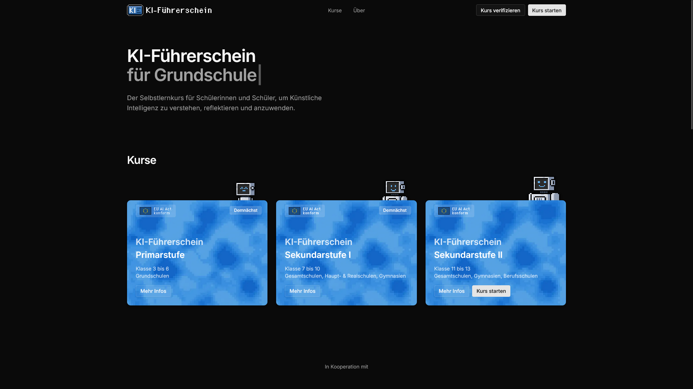
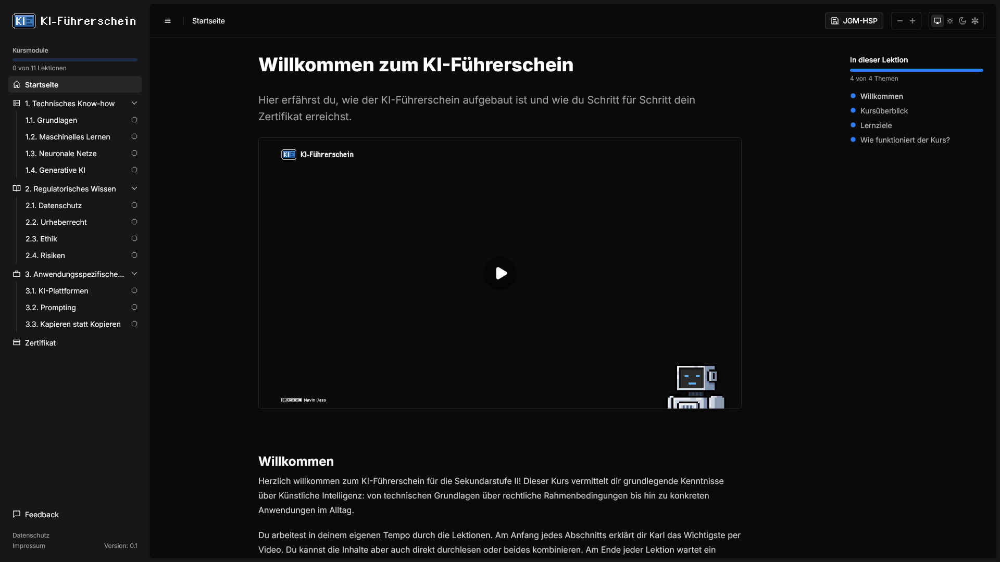
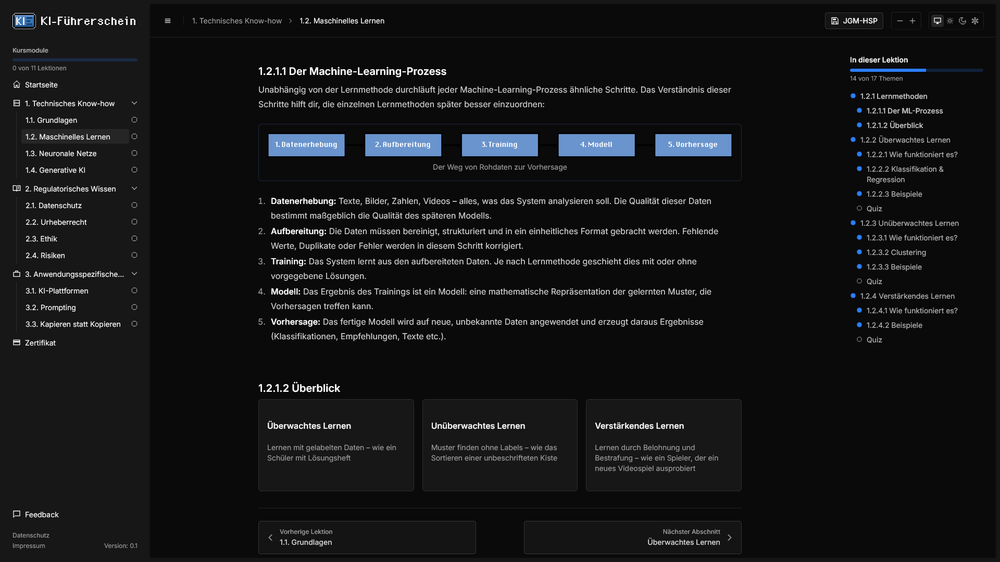

  

<h3 align="center">Selbstlernkurs für Schülerinnen und Schüler, um Künstliche Intelligenz zu verstehen, reflektieren und anzuwenden.</h3>

  
  
  
  
  
  
  

---

## Über das Projekt

Der **KI-Führerschein** ist ein kostenloser, digitaler Selbstlernkurs, der Schülerinnen und Schülern KI-Kompetenzen vermittelt. Von technischen Grundlagen über den EU AI Act bis hin zu praktischen Anwendungen wie Text-to-Text und Text-to-Image lernen die Schülerinnen und Schüler den verantwortungsvollen Umgang mit Künstlicher Intelligenz. Am Ende erhalten sie ein verifizierbares Zertifikat.

Das Projekt ist als Idee der Arbeitsgruppe „Künstliche Intelligenz" der Karl Kübel Schule Bensheim entstanden und wird in Kooperation mit dem Staatlichen Schulamt für den Landkreis Bergstraße und den Odenwaldkreis weiterentwickelt.

> **Hinweis:** Der Quellcode ist nicht öffentlich. Dieses Repository dient als Projektübersicht.

## Screenshots

### Landingpage

Die Startseite mit Kursauswahl für drei Schulstufen: Primarstufe (Klasse 3-6), Sekundarstufe I (Klasse 7-10) und Sekundarstufe II (Klasse 11-13).

  

### Kursübersicht

Die Kursübersicht mit Navigationsstruktur, Einführungsvideo und Fortschrittsanzeige. Die Sidebar zeigt alle Module und Lektionen auf einen Blick.

  

### Lektionsansicht

Eine interaktive Lektion mit didaktisch aufbereiteten Inhalten, Schritt-für-Schritt-Visualisierungen und eingebettetem Quiz.

  

## Features

- **Drei Schulstufen** — Primarstufe, Sekundarstufe I und Sekundarstufe II
- **EU AI Act** — Inhalte orientiert an den regulatorischen Anforderungen für verantwortungsvollen KI-Umgang
- **DSGVO-konform** — Anonymes Fortschritts-Tracking ohne Registrierung, keine personenbezogenen Daten
- **Verifizierbares Zertifikat** — PDF-Zertifikat nach erfolgreichem Abschluss, mit QR-Code überprüfbar
- **Kostenlos** — Kein Login, keine Paywall, kein Tracking
- **Interaktive Quizze** — Multiple Choice, Drag-and-Drop, KI-gestützte Freitextbewertung
- **Responsiv** — Optimiert für Desktop, Tablet und Smartphone

## Kooperationspartner

- [Karl Kübel Schule Bensheim](https://karlkuebelschule.de)
- Staatliches Schulamt für den Landkreis Bergstraße und den Odenwaldkreis
- Medienzentrum Heppenheim

## Links

- [Live Demo](https://demo.ki.fuehrerschein.schule)
- [Über das Projekt](https://demo.ki.fuehrerschein.schule/ueber)
- [trivial.xyz](https://trivial.xyz)

## Kontakt

Fragen, Feedback oder Interesse an einer Kooperation? Schreib über das [Kontaktformular](https://demo.ki.fuehrerschein.schule/kontakt).

---

Entwickelt von <a href="https://trivial.xyz/ueber">Navin Dass</a>

